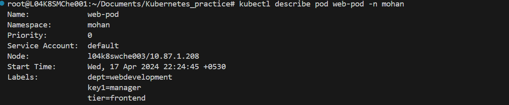

# write a pod with initcontainer and main container using a busybox image. Execute print statements within both the containers. Analyze the logs of both initcontainer and main container

## steps:

* kubectl apply -f Task-6.yml

* kubectl logs  busybox-example --timestamps=true -c init-container -n mohan

* kubectl logs  busybox-example --timestamps=true -c main-container -n mohan

