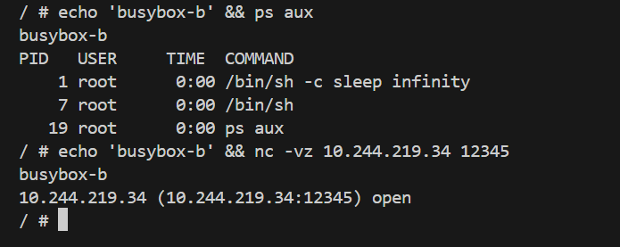

## To demonstrate that a networking stack for a pod is common for underlying containers and process space is specific to each containers. Create a pod with 2 containers (e.g using busybox image, ensure the container runs continuosly). Start a listening socket (using nc) in one container and display the socket status in another container. List the processes in both the container using ps aux. Take screen shots of the output and provide it as your answers

## Steps:

`* kubectl apply -f Task-4.yml`

`* kubectl get pod -n mohan`

`* kubectl exec -it task-4 -n mohan -c busybox-a -- /bin/sh`

busybox-a IP: 10.244.219.34/32
busybox-b IP: 10.244.219.34/32

## busybox-a

## busybox-B

# conclusion:

* Both container IP's are same but the process running those containers different
* from one container to another container can acess the process using pod ip
