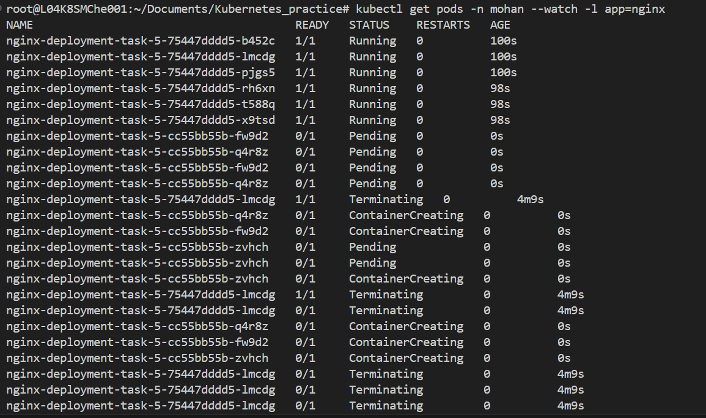

## Write a deployment (nginx image version 1.14.2) with 6 replicas for rolling update. The maxunavailable is 1. Update the deployment with nginx image 1.16.1. Write appropriate command to show the progress of the rolling update. Rollback the update back to previous version. Take screenshots of all your command outputs

## steps:

* kubectl apply -f Task-5.yml

* kubectl exec -it nginx-deployment-task-5-75447dddd5-tpcqz -n mohan -c nginx-container -- nginx -v  # check nginx version

`nginx version: nginx/1.14.2`

### change the version in deployment yml file

* kubectl apply -f Task-5.yml

* kubectl get pods -n mohan --watch -l app=nginx # Monitor the rolling update

* kubectl exec -it nginx-deployment-task-5-cc55bb55b-7vpd9 -n mohan -c nginx-container -- nginx -v

`nginx version: nginx/1.16.1`

