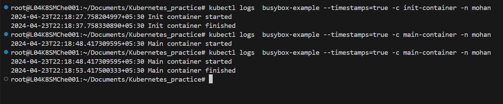

## create 3 pods with labels dept=webdevelopment. In one pod add label tier=frontend in another 2 pods add label tier=backend. Display pods with dept in webdevelopment and tier not equal to frontend

## steps:

    * kubectl run web-pod --image=nginx --labels=dept=webdevelopment,tier=frontend -n mohan
    * kubectl run web-pod-1 --image=nginx --labels=dept=webdevelopment,tier=backend -n mohan
    * kubectl run web-pod-2 --image=nginx --labels=dept=webdevelopment,tier=backend -n mohan
    
    * kubectl get pods --selector='dept=webdevelopment,tier!=frontend' -n mohan

    
    * kubectl describe pod web-pod

    * kubectl label pods web-pod-2 tier- --overwrite -n mohan
    * kubectl label pods web-pod-2 fe=backend -n mohan

    
    * kubectl get pod -n mohan  --show-labels

